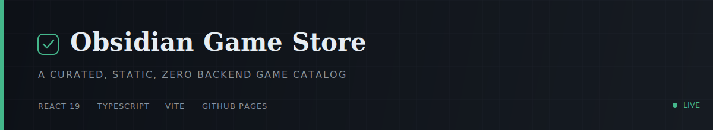
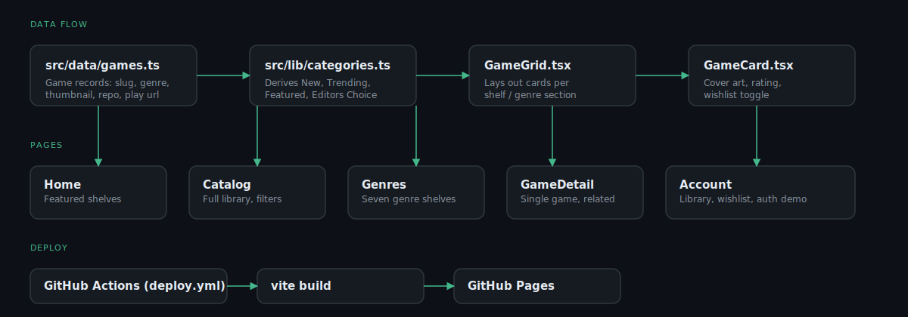

<div align="center">
  
</div>

<div align="center">

[](https://github.com/hassanireza/obsidianGameStore/actions/workflows/deploy.yml)
[](https://react.dev)
[](https://www.typescriptlang.org)
[](https://vitejs.dev)
[](https://hassanireza.github.io/obsidianGameStore/)
[](#local-development)

</div>

<br/>

A React and TypeScript rebuild of the Obsidian game catalog, deployed as a
static single page app to GitHub Pages.

<br/>

## Architecture



<br/>

## What changed from the old Django app

<table>
<tr>
<td width="28" valign="top"></td>
<td>
<strong>Full rebuild in React 19, TypeScript, and Vite.</strong> No backend required.
</td>
</tr>
<tr>
<td valign="top"></td>
<td>
<strong>Design system rewritten</strong> to a near black, museum catalog aesthetic: serif display type, thin sans body copy, no saturated color, slow critically damped scroll reveals, and a subtle film grain overlay.
</td>
</tr>
<tr>
<td valign="top"></td>
<td>
Name corrected from "Obsidian Game Club" to <strong>Obsidian Game Store</strong>. Genres reduced from nine to seven: Chess and Puzzle and Strategy now share one shelf, "Puzzle & Strategy", since they were the same kind of thinking game.
</td>
</tr>
<tr>
<td valign="top"></td>
<td>
<strong>New, Trending, Featured, and Editors Choice</strong> are no longer flags an admin flips. They are computed in <code>src/lib/categories.ts</code> from real fields: release date recency, play count, rating, and review volume. Not every game qualifies for every shelf.
</td>
</tr>
<tr>
<td valign="top"></td>
<td>
Games that live inside <code>pixelRealms</code> (Neon Blocks, Neural Grid, Tic Tac Toe) and <code>driftlineArcade</code> (Skyfold Aviary, VoidRunner) link straight to the specific game path on GitHub Pages, skipping each repo's own landing page. Every game card also links to its real GitHub source repository.
</td>
</tr>
<tr>
<td valign="top"></td>
<td>
<strong>Sign in and sign up are a working demo only.</strong> There is no server: an email creates a session in <code>localStorage</code>, and library and wishlist state persist per browser. See <code>src/lib/auth.tsx</code>.
</td>
</tr>
<tr>
<td valign="top"></td>
<td>
Individual game logic and assets are untouched, exactly as requested, ready for you to upgrade repo by repo later. The store only supplies the shell, the cover art, and the linking.
</td>
</tr>
</table>

<br/>

## Adding a new game later

Open `src/data/games.ts` and add an entry with a slug, genre, cover image
(drop a webp or svg into `public/covers`), repo URL, and a play URL. It
appears in the catalog, its genre shelf, and is eligible for New, Trending,
and Featured automatically based on its data.

<br/>

## Local development

```bash
npm install
npm run dev
```

## Production build

```bash
npm run build
npm run preview
```

## Deploying

A GitHub Actions workflow at `.github/workflows/deploy.yml` builds and
publishes `dist` to GitHub Pages on every push to `main`.

1. Push this repository to GitHub.
2. In the repo, go to Settings, then Pages, and set Source to
   "GitHub Actions".
3. Push to `main`. The workflow sets the Vite base path automatically
   from the repository name, so the site works whether the repo is
   named `obsidianGameStore` or anything else.

If you ever build locally for a specific repo name, pass it explicitly:

```bash
VITE_BASE_PATH=/your-repo-name/ npm run build
```

<br/>

<div align="center">
<sub>Built with React, TypeScript, and Vite. No dependencies at runtime beyond the browser.</sub>
</div>
